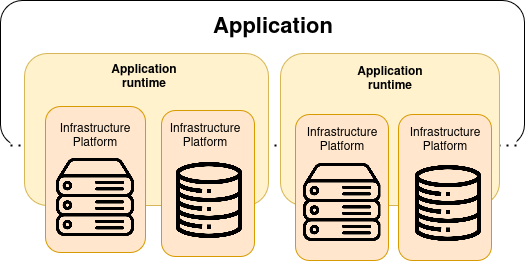
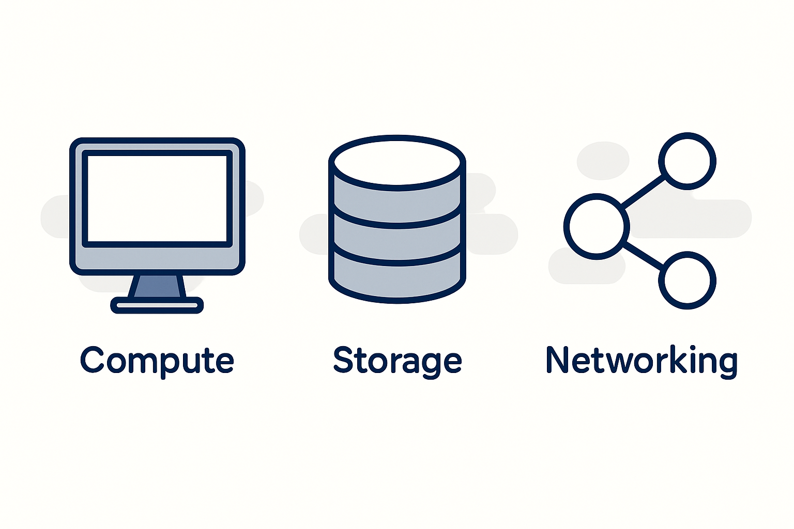

[__🧭 BACK TO MODULE__](../README.md)

> [⬅️ PREVIOUS CHAPTER](./2-principles-of-cloud-age-infrastructure.md) __|__ [NEXT CHAPTER ➡️](./4-core-practice-everything-as-code.md)

---

# Infrastructure Platform

This chapter presents a model of thinking about the higher-level concerns of your platform, the capabilities it provides, and the infrastructure resoruces you may assemble to provide these capabilities.

## The parts of an Infrastructure System

It is helpful to group the different parts, in a modern cloud infrastructure, into three platform layers.

- __Infrastructure platform__: The infrastructure platform is the set of infrastructure resources and the tools and services that manage them.
- __Application runtimes__: It provide services and capabilities to the application layer. Example of services and constructs in an application runtime platform include container clusters, serverless environments, application servers, operating systems and databases.
- __Applications__: These provide capabilities to your organization and its users. Everything else in this model exists to enable this layer

  

The premise of this summary is using the infrastructure platform layer to assemble infrastructure resources to create the application runtime layer and, at the end, server the application.

## Deep dive into infrastructure platform resources

Infrastructure as Code requires a _dynamic_ infrastructure platform, something that you can use to provision and change resources on demand with an API.

This layer contains essentially all resources provided by the cloud which is basically Infrastructure as a service.

> Here's how NIST defines IaaS: The capability provided to the consumer is to provision processing, storage, networks, and other fundamental computing resources where the consumer is able to deploy and run arbitrary software, which can include operating systems and applications. The consumer does not manage or control the underlying infrastructure but has control over operating system, storage, and deployed applications; and possibly limited control of select networking components (e.g. host firewalls).

There are different types of infrastructure platforms, from full-blown public clouds to private clouds; from commercial vendors to open source platforms. Here is a list examples of vendors, products, and tools for each type of cloud infrastructure platform.

| **Type of platform** | **Providers or products** |
|---|---|
| Public IaaS cloud services | AWS, Azure, Digital Ocean, GCE, Linode, Oracle Cloud, OVH, Scaleway and Vultr |
| Private IaaS cloud products | CloudStack, OpenStack, and VMware vCloud |
| Bare-metal cloud tools | Cobbler, FAI, and Foreman |

> Different vendors may package and offer the same resources in different ways, or at least with different names. For example, for an object storage there are: AWS's S3, Azure's blob storage and GCP cloud storage.

**At the basic level, infrastructure platforms provide compute, storage, and networking resource**.

> Most public cloud vendors provide resources, or bundles of resources, which combine to provide higher-level services for deploying applications. This is called Platform as a Service.

### Primitive resources

There are three essential resources provided by an infrastructure platform: __compute, storage and networking__. Different platforms combine and package these resources in different ways.

These resources are called _primitives_. Cloud platforms combine infrastructure primitives into composite resources, such as:
- Database as a Service
- Load balancing
- DNS
- Identity management
- Secrets management

The line between a primitive and a composite resource is arbitrary, as is the line between a composite infrastructure resource and an application runtime service. Even a basic storage service like object storage (think AWS S3 buckets) involves compute and networking resources to read and write data.

  

#### Compute Resources

Compute resources execute code. At it most elemental, __compute is execution time on a physical server CPU core__. But platforms provide compute in more useful ways. Common compute resource resources include:
- Virtual machines (VMs)
- Physical servers
- Server clusters
- Containers
- Application hosting clusters
- FaaS serverless code runtime

#### Storage Resources

Many dynamic systems need storage, such as disck volume, databases, or central repositories for files. Even if your application doesn't use storage directly, many of the services it does use will need it, if only for storing compute images.

Typical storage resources found on infrastructure platforms are:
- Block storage
- Object storage
- Networked filesystems
- Structured data storage
- Secrets management

#### Network Resources

As with the other types of infrastructure resources, the capability of dynamic platforms to provision and change networking on demand, from code, creates great opportunities.

Typical of networking constructs and services an infrastructure platform provides include:
- Network address blocks
- Names, such as DNS entries
- Routes,
- Gateways
- Load balancing rules
- Proxies
- API gateways
- Virtual Private Networks
- Direct connection
- Network access rules (firewall rules)
- Asynchronous messaging
- Cache
- Service mesh

## Multi-cloud

Many organizations end up hosting across multiple platforms. A few terms crop up to describe variations of this:

### Hybrid cloud

Hosting application and services from a system across both private infrastructure and a public cloud service. People often do this because of legacy systems that they can't easily migrate to a public cloud service (such as services running on mainframes). In other cases, organizations have requirements that public cloud vendors can't currently meet, such as legal requirements to host data in a country where the vendor doesn't have a presence.

### Cloud agnostic

Building systems so that they can run on multiple public cloud platforms. People often do this hoping to avoid lock-in to one vendor. In practice, this results in locks in to software that promises to hide differences between clouds, or involves building and maintaining vast amounts of customized code, or both.

Here some examples:
| Name | Type / Function | Notes & Supported Clouds |
|------|------------------|--------------------------|
| **Kubernetes** | Container orchestration | Can run on virtually all major cloud providers and on-premises. |
| **Terraform (by HashiCorp)** | Infrastructure as Code (IaC) | Supports many providers (AWS, Azure, GCP, etc.) via plugins. |
| **Pulumi** | IaC / Multi-language | Similar to Terraform but supports general purpose languages. |
| **OpenStack** | Private / hybrid cloud platform | Can be deployed in your own infrastructure and integrated with public clouds. |
| **Apache CloudStack** | Infrastructure as a Service (IaaS) platform | Hypervisor-agnostic; supports AWS API compatibility. |
| **ManageIQ** | Cloud management / orchestration | Provides unified management for virtualization, public clouds, containers, SDN. |
| **Qstack** | Cloud management platform | Allows managing hybrid and multiple clouds through a single interface. |
| **openQRM** | Data center / cloud orchestration | Manages heterogeneous infra, supports VM, storage, network, and cloud integration. |
| **soCloud** | PaaS multi-cloud platform | Designed for application portability, provisioning, high availability across clouds. |
| **CloudLaunch** | Application deployment layer | Offers a uniform interface to launch applications across different cloud providers. |
| **Panzura** | Multi-cloud unstructured data management | Unifies data across clouds, on-prem, and edge environments. |

### Poly cloud

Running different applications, services, and systems on more than one public platform. THis is usually to exploit different strengths of different platforms.
