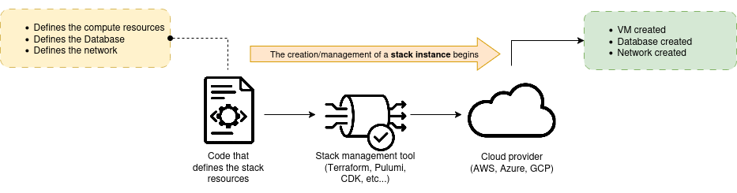
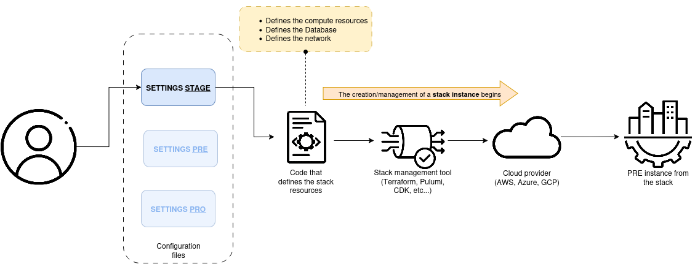

[__🧭 BACK TO MODULE__](../README.md)

> [NEXT CHAPTER ➡️](./2-building-environment-with-stacks.md)

---

# Building Infrastructure Stacks as Code

This chapter describes patterns for grouping infrastructure resources in stacks.

## What Is an Infrastructure Stack?

__An infrastructure stack is a collection of infrastructure resources that you define, provision, and update as unit__. 

You write source code to define the elements of a stack, which are resources and services that your infrastructure platform provides. For example, your stack may include a virtual machine, database and a subnet (all of these components are primitive resources [which are been seen here](../../1-foundation/chapters/3-infrastructure-as-platform.md#primitive-resources)).

We could summarize this concept as follows:
<p align="center">
  
</p>

When you run the stack management tool, which reads your stack source code and uses the cloud platform's API to assemble the elements defined in the code to __provision an instance of your stack__.

Examples of stack management tools include:
- [HashiCorp Terraform](https://www.hashicorp.com/es/products/terraform)
- [AWS CloudFormation](https://aws.amazon.com/es/cloudformation/)
- [Azure Resource Manager](https://azure.microsoft.com/es-es/get-started/azure-portal/resource-manager)
- [Google Infrastructure Manager](https://cloud.google.com/infrastructure-manager/docs)
- [Pulumi](https://www.pulumi.com/)

## Stack Code

Each stack is defined by source code that declares what infrastructure elements it should include. Terraform code and CloudFormation templates are both examples of infrastructure stack code. A stack project contains the source code that defines the infrastructure for a stack.

Example a Terraform project where an stack its been defined:
```sh
tree stack-project
stack-project
├── src
│   ├── database.tf
│   ├── dns.tf
│   ├── load_balancer.tf
│   ├── networking.tf
│   └── virtual_machine.tf
└── test

3 directories, 5 files
```

> In the above list of files, please note that not all of those defined by Terraform best practices are shown (outputs.tf, variables.tf, locals.tf, etc.).

## Stack instances

You can sue a single stack project to provision more than one stack instance. When you run the stack tool for the project, it uses the platform API to ensure that stack instances exists, and to make it match the project code. If the stack instance doesn't exist, the tool creates it. If the stack instance exist but doesn't exactly match the code, then the tool modifies the instance to make it match.

This process is often described as "applying" the code to an instance.

If you change the code and rerun the tool, it changes the stack instance to match your changes. If you run the tool one more time without making any changes to the code, then it should leave the stack instance as it was.

<p align="center">
  
</p>

