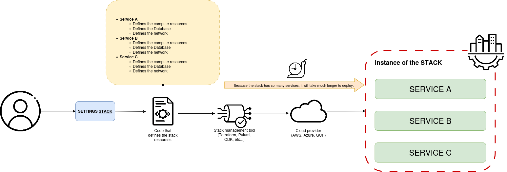

[__🧭 BACK TO MODULE__](../README.md)

> [NEXT CHAPTER ➡️](./2-building-environment-with-stacks.md)

---

# Building Infrastructure Stacks as Code

This chapter describes patterns for grouping infrastructure resources in stacks.

---

## Stack concepts

### What Is an Infrastructure Stack?

__An infrastructure stack is a collection of infrastructure resources that you define, provision, and update as unit__. 

You write source code to define the elements of a stack, which are resources and services that your infrastructure platform provides. For example, your stack may include a virtual machine, database and a subnet (all of these components are primitive resources [which are been seen here](../../1-foundation/chapters/3-infrastructure-as-platform.md#primitive-resources)).

We could summarize this concept as follows:
<p align="center">
  
</p>

When you run the stack management tool, which reads your stack source code and uses the cloud platform's API to assemble the elements defined in the code to __provision an instance of your stack__.

Examples of stack management tools include:
- [HashiCorp Terraform](https://www.hashicorp.com/es/products/terraform)
- [AWS CloudFormation](https://aws.amazon.com/es/cloudformation/)
- [Azure Resource Manager](https://azure.microsoft.com/es-es/get-started/azure-portal/resource-manager)
- [Google Infrastructure Manager](https://cloud.google.com/infrastructure-manager/docs)
- [Pulumi](https://www.pulumi.com/)

### Stack Code

Each stack is defined by source code that declares what infrastructure elements it should include. Terraform code and CloudFormation templates are both examples of infrastructure stack code. A stack project contains the source code that defines the infrastructure for a stack.

Example a Terraform project where an stack its been defined:
```sh
tree stack-project
stack-project
├── src
│   ├── database.tf
│   ├── dns.tf
│   ├── load_balancer.tf
│   ├── networking.tf
│   └── virtual_machine.tf
└── test

3 directories, 5 files
```

> In the above list of files, please note that not all of those defined by Terraform best practices are shown (outputs.tf, variables.tf, locals.tf, etc.).

### Stack instances

You can sue a single stack project to provision more than one stack instance. When you run the stack tool for the project, it uses the platform API to ensure that stack instances exists, and to make it match the project code. If the stack instance doesn't exist, the tool creates it. If the stack instance exist but doesn't exactly match the code, then the tool modifies the instance to make it match.

This process is often described as "applying" the code to an instance.

If you change the code and rerun the tool, it changes the stack instance to match your changes. If you run the tool one more time without making any changes to the code, then it should leave the stack instance as it was.

<p align="center">
  
</p>

---

## The code that will run the infrastructure

You should decouple code that builds servers from code that builds stacks. Doing this makes the code easier to understand, simplifies changes by decoupling them, and supports reusing and testing server code.

---

## Patterns and Anti-patterns for Structuring Stacks

One challenge with infrastructure design is deciding how to size and structure stacks. You could create a single stack code project to manage your entire system. But this becomes unwieldy as your system grows. In this section, its going to be described patterns and anti-patterns for structuring infrastructure stacks.

### Anti-patterns: Monolithic Stack

A monolithic stack is an infrastructure stack that includes too many elements, making it difficult to maintain.

What distinguishes a monolithic stack from other patterns is that the number or relationship of infrastructure elements within the stack is difficult to manage well.

People build monolithic stacks because the simplest way to add a new element to a system is to add it to the existing project. Each new stack adds more moving parts, which may need to be orchestrated, integrated and tested.

<p align="center">
  
</p>

> You can see an example of this pattern in Terraform in [this section](../../../patterns/1-stack-patterns/1-anti-pattern-monolithic-stack/README.md).

A monolithic stack may be appropriate when your system is small and simple. It's not appropriate when your system grows, to taking longer to provision and update.

The impact of a failed change may be broader since there are more services and applications within the stack. Larger stacks are also slower to provision and change, which makes them harder to manage.

##### Is my stack a monolith ?

Whether your infrastructure stack is a monolith is a matter of judgment.

The symptoms of a monolithic stack include:
- It's difficult to understand how the pieces of the stack fit together
- New people take a while learning the stack's codebase
- Debugging problems with the stack is hard
- Changes to the stack frequently cause problems
- You spend too much time maintaining systems and processes whose purpose is to manage the complexity of the stack

---

### Pattern: Application Group Stack

An application group stack includes the infrastructure for **multiple related services that together form a single application**. The infrastructure for all of these services is provisioned and managed **as one unit**.

You can understand this pattern as an evolution of a monolithic approach, with clearer internal boundaries:
- __Monolithic Stack__: Groups the **entire IT solution** (possibly multiple applications) into a single stack.
- __Application Group Stack__: Groups **all services belonging to one application** into a single stack.

Defining the infrastructure for multiple related services together makes it possible to manage the **entire application lifecycle** as a single unit (provisioning, deployment, rollback, and teardown).

<p align="center">
  
</p>

> You can see an example of this pattern in Terraform in [this section](../../../patterns/1-stack-patterns/2-pattern-application-group-stack/README.md).

This pattern works well when a **single team owns the full application**, including all of its services and infrastructure. The boundaries of the stack align with the **application boundary**, which often matches the team's responsibilities.

However, grouping all services into one stack also **couples their change lifecycle**. Any infrastructure change—no matter how small—requires planning, applying, and validating the **entire application stack**.

As a result, __this pattern becomes inefficient when different services within the same application change at different frequencies or have different risk profiles__.

---

### Pattern: Service Stack

A service stack manages the infrastructure for **a single deployable application component** in its own, independent infrastructure stack.

Service stacks align the boundaries of infrastructure with the **software deployment unit**. Each stack typically includes everything required to run one service: compute, networking configuration, permissions, and any service-specific dependencies.

This alignment significantly reduces the **blast radius of changes**. Infrastructure updates, scaling actions, or failures affect only the service that owns the stack, making change management and release scheduling simpler and safer.

<p align="center">
  
</p>

> You can see an example of this pattern in Terraform in [this section](../../../patterns/1-stack-patterns/3-pattern-service-stack/README.md).

Service stacks are a natural fit for [microservices](https://martinfowler.com/articles/microservices.html) architectures, where a single application is composed of many small, independently deployable services. They also support organizational models with **autonomous or cross-functional teams**, where each team owns both the service code and its infrastructure.

> In short, the microservice architectural style is an approach to developing a single application as a suite of small services, each running in its own process and communicating with lightweight mechanisms, often an HTTP resource API.

One trade-off of this pattern is the potential **duplication of infrastructure code** across stacks. For example, multiple service stacks may define similar resources such as application servers, logging, or monitoring. Without shared modules or abstractions, this duplication can lead to **inconsistency and higher maintenance effort**.

---

### Pattern: Micro Stack

The micro stack pattern divides the infrastructure for a single service across multiple stacks. For example, you may have a separate stack project each for the networking, servers, and database.

Different parts of a service's infrastructure change at different rates. Or they may have different characteristics that make them easier to manage separately. For instance, some methods for managing server instances involve frequently destroying and rebuilding them. However, some services use persistent data in a database of disk volume. Managing the servers and data in separate stacks means they can have different life cycle, with the server stack being rebuild much more often than the data stack.

<p align="center">
  
</p>

> You can see an example of this pattern in Terraform in [this section](../../../patterns/1-stack-patterns/4-micro-stack/README.md).
