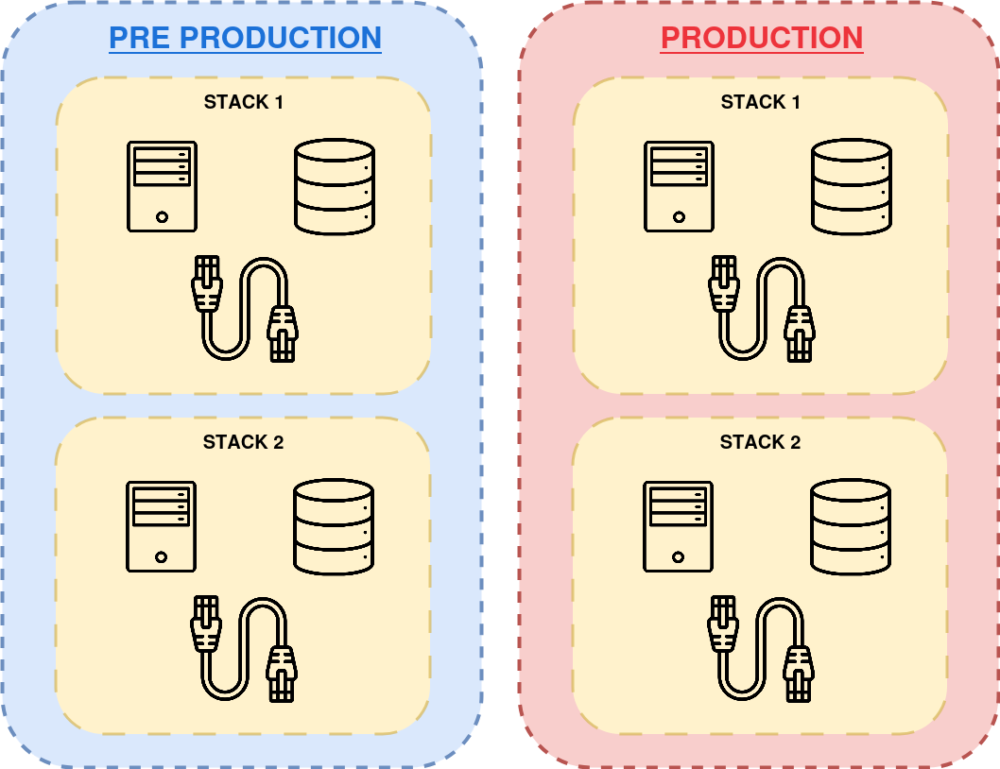
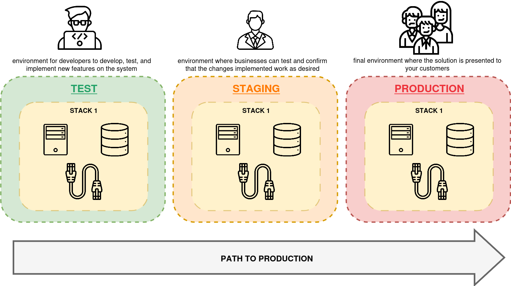
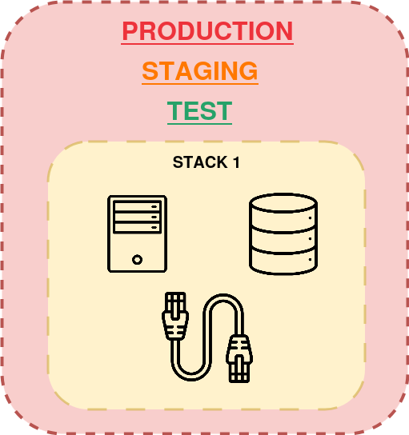
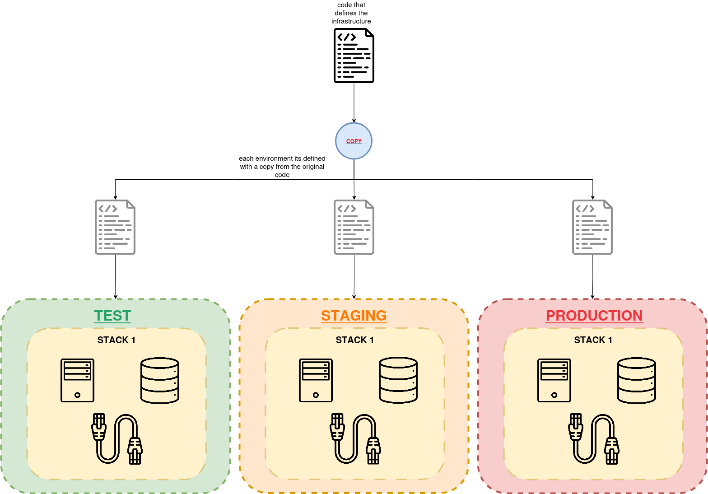

[__🧭 BACK TO MODULE__](../README.md)

> [⬅️ PREVIOUS CHAPTER](./1-building-infrastructure-stacks-as-code.md) __|__ [NEXT CHAPTER ➡️](./3-configuring-stack-instances.md)

---

# Building Environment with Stacks

The last chapter described an infrastructure stack as a collection of infrastructure resources that you manage as a single unit. An environment is also a collection of infrastructure resources. So is a stack the same thing as an environment? This chapter explains that maybe it is, but maybe it isn't.

We can define each concept as follows:
- __Environment__: Collection of software and infrastructure resources organized around a particular purpose, such as to support a testing phase, or to provide service in a geographical region.
- __Stack__: Means of defining and managing a collection of infrastructure resources.

  

> You might implement an environment as a single stack, or you might compose an environment from multiple stacks. You could even create several environments in one stack, although you shouldn't.

## Delivery Environments

The most familiar use case for multiple environments is to support a progressive software release process (sometimes called the path to production). A given build of an application is deployed to each environment in turn to support different development and testing activities until it is finally deployed to the production environment.

  

There are other reasons to implement multiple environments. Reasons to do this include:
- __Fault tolerance__: If one environment fails, others can continue to provide service. Doing this could invole a failover process to shift load from the failed environment. However, creating a higher degree of fault tolerance, it implies an higher cost.
- __Scalability__: You can spread a workload across multiple environments. People often do this geographically, with a separate environment for each region.
- __Segregation__: Stronger segregation may help meet legal or compliance requirements and give greater confidence to customers.

## Environments, consistency, and configuration

Since multiple environments are meant to run instances of the same system, the infrastructure in each environment should be consistent. Consistency across environments is one of the main drivers of IaC.

Differences between environments create the risk of inconsistent behavior. Testing software in one environment might not uncover problems that occur in another. It's even possible that software deploys successfully in some environments but not others.

On the other hand, you typically need some specific differences between environments. Test environments may be smaller than production environments. Different people may have different privileges in different environments. Environments for different customers may have different features and characteristics.

# Patterns for building Environments

## Antipattern: Mutliple-Environment Stack

A multiple-environment stack defines and manages the infrastructure for multiple environments as a single stack instance.

Many people create this type of structure when they're learning a new stack tool because it seems natural to add new environments into an existing project.

When running a tool to update a stack instance, __the scope of a potential change is everything in the stack__. If you have a mistake or conflict in your code, everything in the instance is vulnerable.

> [Here is a well known case from Charity Majors](https://charity.wtf/2016/03/30/terraform-vpc-and-why-you-want-a-tfstate-file-per-env/) where she shares her experience where she was using the multiple-environment stack 

  

> You can see an example of this pattern in Terraform in [this section](../../../patterns/2-environment-patterns/1-antipattern-multiple-environment-stack/README.md).

When your production environment is in the same stack instance as another environment, changing the other environment risks causing a production issue. A coding error, unexpected dependency, or even a bug in your tool can break production when you only meant to change a test environment.

## Antipattern: Copy-Paste Environments

The copy-paste environments antipattern uses a separate stack source code project for each infrastructure stack instance.

In the following example it can be seen three environments. Each of these environments have they own stack. **Changes are made by editing the code in one environment and then copying the changes into each of the other environments in turn**.

  

> You can see an example of this pattern in Terraform in [this section](../../../patterns/2-environment-patterns/2-antipattern-copy-paste-environment/README.md).

It can be challenging to maintain multiple copy-paste environments. WHen you want to make a code change, you need to copy it to every project. You probably need to test each instance separately, as a change may work in one but not another.

Using copy-paste environments for delivery environments reduces the reliability of the deployment process and the validity of testing, due to inconsistencies from one environment to the next.

## Pattern: Reusable Stack

> Introduction

> Image summary

> You can see an example of this pattern in Terraform in [this section](../../../patterns/2-environment-patterns/3-pattern-reusable-stack/README.md).

> Conclusion