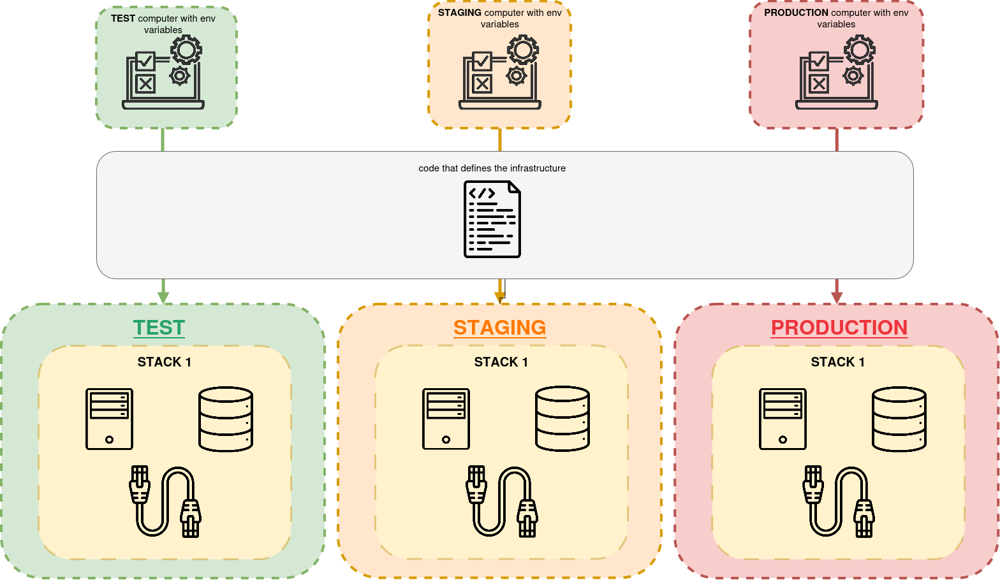

[__🧭 BACK TO MODULE__](../README.md)

> [⬅️ PREVIOUS CHAPTER](./2-building-environment-with-stacks.md) __|__ [NEXT CHAPTER ➡️](./4-core-practice-continuously-and-deliver.md)

---

# Configuring Stack Instances

Using a single stack code project makes it easier to maintain multiple consistent instances of infrastructure.

> To accomplish this the [reusable pattern](./2-building-environment-with-stacks.md#pattern-reusable-stack) can be used.

However, you often need to customize different instances of a stack. For example, might size a cluster with fewer servers ina  development environment that in production.

Stacks tools such as Terraform and CloudFormation support multiple ways of setting configuration parameter values. These typically include passing values on the command line, reading them from a file, and having the infrastructure code retrieve them from a key-value store. Teams managing infrastructure need to decide how to use these features to manage and pass configuration values to their stack tool. It's essential to ensure the values are defined and applied consistently to each environment.

## Using Stack Parameters to create unique identifiers

If you create multiple stack instances from the same project, you may see failures from infrastructure resources that require unique identifiers. Think about it.

What would happen if you have two files (one for a test environment and another for production) with the following code?
```tf
resource "aws_s3_bucket" "service_bucket" {
    bucket = "service-bucket"
}
```

It will crash because both resources, even when they correspond to different environments, they share the same name and the cloud platform requires the id to be unique. But this can be solved if you take into account that each stack defines its own parameters and these can help you to create its own unique names.

Going back to our example, if we use the own environment parameters we can create an unique id, allowing to create multiple stack instances without running into errors.

```tf
resource "aws_s3_bucket" "service_bucket" {
    bucket = "service-bucket-${var.environment}"  # In production the name of the environment it would be `service-bucket-pro`
}
```

> In [this](../../../patterns/3-configuration-patterns/2-environment-patterns/3-pattern-reusable-stack/README.md) example is shown an example where different setting are set for each environment keeping the same infrastructure code.

## Pattern for Configuring Stacks

We've looked at why you need to parametrize stacks and a bit on how the tools implement parameters. Now I'll describe some patterns and antipatterns for managing parameters and passing them to your tool.

### Anti-pattern: Manual Stack Parameters

The most natural approach to provide values for a stack instance is to type the values on the command line manually.

For example lets think that the stack needs the variable environment to run. We could just instance the stack with the following command:
```tf
terraform apply -var 'env=pro'
```

> Since this anti-pattern has already been shown in the previous command, there will be no examples in the pattern section.

It's dirt-simple to type values on the command line, which is helpful when you're learning how to use a tool. It's also useful to type parameters on the command line to experiment. It's also easy to make mistake's when typing a value on the command line. It can also be hard to remember which values are been typed.

For infrastructure that people care about, you probably don't want the risk of accidentally breaking something important by mistyping a command when making improvements or fixes. When multiple people work on an infrastructure stack, as in a team, you can't expect everyone to remember the correct values to type for each instance.

Manual stack parameters aren't suitable for automatically applying infrastructure code to environments, such as with CI or CD.

### Pattern: Stack environment parameters

The stack environment variable pattern involves setting parameter values as environment variables for the stack tool to use. This pattern is often combined with another pattern to set the environment variables.

To implement it, you need to se the environment variables to use, which means selecting another pattern from this chapter. For example, _if you expect people to set environment variables in their local environment to apply stack code, you are using the manual stack anti pattern_. You could set them in a script that runs the stack tool, or have the pipeline tool set them.

Another approach is to put the values into a script that people or instances import into their local environment. This is a variation of the stack configuration files pattern. The script to set the variables would be exactly any command that runs the stack tool would import it into the environment.

> You can see an example of this pattern in Terraform in [this section](../../../patterns/3-configuration-patterns/1-stack-environment-variables/README.md).

<p align="center">
  
</p>

### Pattern: Scripted Parameters

> Description

> You can see an example of this pattern in Terraform in [this section](../../../patterns/3-configuration-patterns/2-scripted-parameters/README.md).

<p align="center">
  
</p>

> Conclusion

### Pattern: Stack Configuration Files

> Description

> You can see an example of this pattern in Terraform in [this section](../../../patterns/3-configuration-patterns/3-stack-configuration-files/README.md).

<p align="center">
  
</p>

> Conclusion

### Pattern: Wrapper Stack

> Description

> You can see an example of this pattern in Terraform in [this section](../../../patterns/3-configuration-patterns/4-wrapper-stack/README.md).

<p align="center">
  
</p>

> Conclusion

### Pattern: Pipeline Stack Parameters

> Description

> You can see an example of this pattern in Terraform in [this section](../../../patterns/3-configuration-patterns/5-pipeline-stack/README.md).

<p align="center">
  
</p>

> Conclusion

### Pattern: Stack Parameters Registry

> Description

> You can see an example of this pattern in Terraform in [this section](../../../patterns/3-configuration-patterns/6-stack-parameter-registry/README.md).

<p align="center">
  
</p>

> Conclusion

---

## Configuration Registry


## Handling Secrets as Parameters

