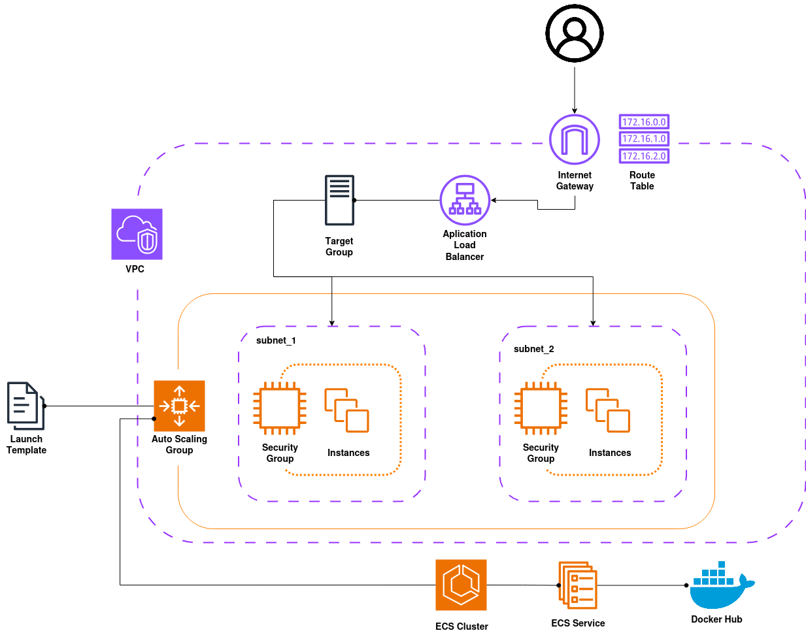

# Base infrastructure

This section defines the solution we will work with in this summary. Practically speaking, this solution will be used to break down the theory behind each of the existing design patterns.

Specifically, this solution consists of a registry that lists the most commonly used web addresses. This registry has access to a database containing the addresses that must be shown in the registry and the number of times they have been accessed.

The solution is segmented as follows:
- __[Webpage_IaC](./src/webpage_iac/README.md)__:
    - Defines the backend and frontend of the web registry
    - The code is written in Python and containerized in Docker
    - The code has been published on [Docker Hub](https://hub.docker.com/repository/docker/joeyratt/webapp-aws/general) for later use in ECS
- __[Services](./src/aws_infrastructure/services.tf)__:
    - Defines how the webpage service will be exposed in ECS
    - The resources the service will have access to are declared here
- __[Clusters](./src/aws_infrastructure/clusters.tf)__:
    - Defines the resources that will form the ECS cluster
    - The cluster machines will run the Webpage images to expose the web registry
    - This section configures service scaling and traffic balancing
- __[Database](./src/aws_infrastructure/database.tf)__:
    - Defines the database that the solution will use to persist information
    - Defines the base records with which the database will be instantiated
- __[Network](./src/aws_infrastructure/network.tf)__:
    - Defines the network where the service will have access to all necessary resources


<p align="center">
  
</p>

Once the solution its deployed (throw `terraform apply`) you can see the access link to the registry using the following command.

```bash
aws elbv2 describe-load-balancers \
  --region eu-west-1 \
  --names ecs-alb \
  --query 'LoadBalancers[0].DNSName' \
  --output text
```

## Known errors

### Deleting the solution

Terraform may show errors when attempting to delete the entire solution using `terraform destroy`. This can happen because the Auto Scaling Group (from the ECS cluster) cannot be deleted while EC2 instances are still running.

In this case, it is recommended to delete the instances either through the CLI using the following commands:
```bash
# Change the scaling plan to scale down all the instances
aws autoscaling update-auto-scaling-group \
    --auto-scaling-group-name 'asg-cluster-instances' \
    --min-size 0 \
    --max-size 0 \
    --desired-capacity 0

# Check if there are any resting instance (if the value is 0, you can delete the entire stack again)
aws autoscaling describe-auto-scaling-groups --auto-scaling-group-name 'asg-cluster-instances' --query 'AutoScalingGroups[0].Instances'
```

