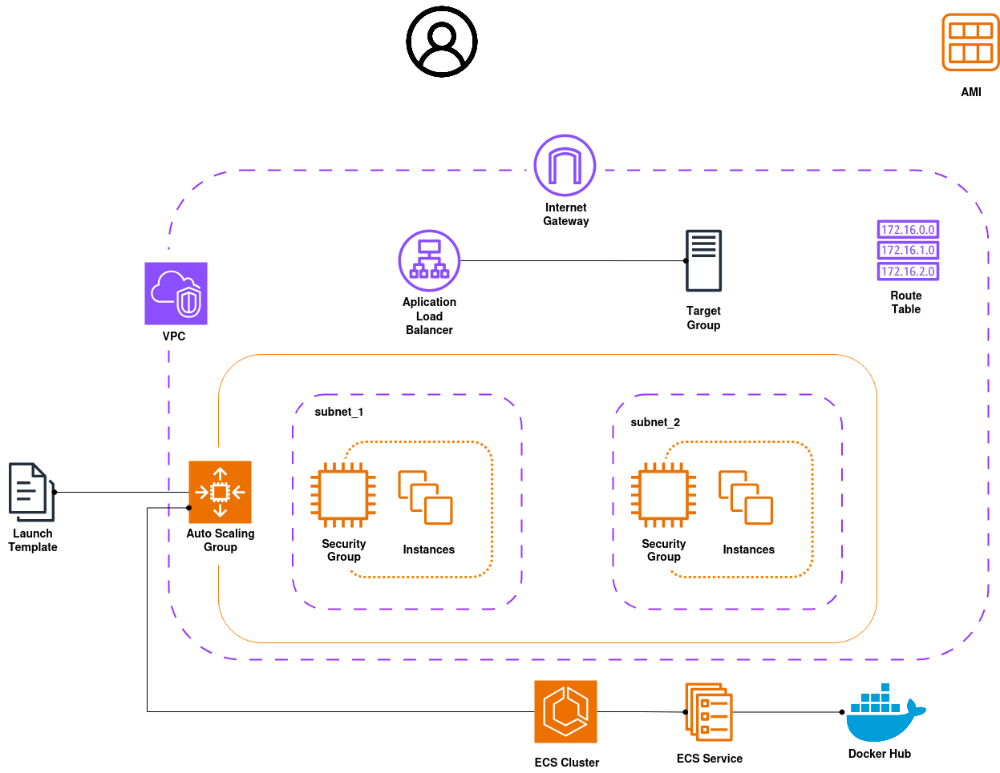

# Base Infrastructure

The following design patterns will be based on an AWS service that consists of a web page capable of persisting information in an internal database.

The web page contains a table with links to external pages and a counter indicating how many times each link has been selected.

The services included are as follows:
- **Service 1**:
  - A web page that lists links stored in the database.
  - When a user selects one of the links, the click is recorded in the same database.
  - The code for this service will be retrieved from [here](https://hub.docker.com/r/joeyratt/webpage).
- **Service 2**:
  - A database where the links displayed on the web page are stored.
  - Additionally, this database keeps track of how many times each link has been selected.

Relations between services:
- Each service will interact with the same database.
- All computing resources will be located in the same network.
- All web pages will be hosted in the same environment.

> **NOTE:** It is likely that the resources described below will evolve over time to accommodate all the design patterns developed in this summary.

  

